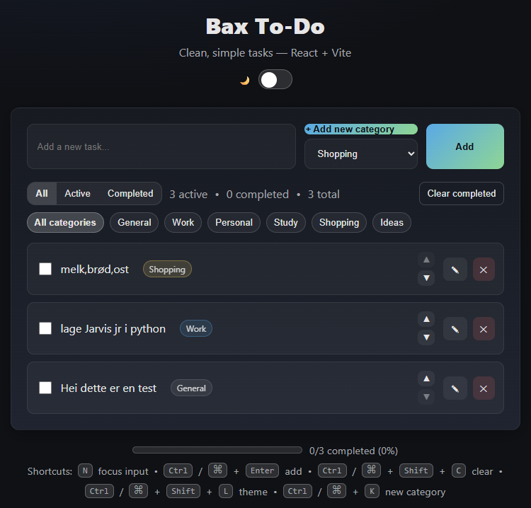

# Pro To-Do (React + Vite)

A clean, professional to-do app built with React and Vite.  
Features include local persistence, categories & filters, edit-in-place, dark/light theme, keyboard shortcuts, and manual reordering (move up/down).

---

## ✨ Features
- CRUD tasks with **inline editing** (double-click or ✎)
- **LocalStorage** persistence
- **Categories** (add your own) + status filters (All / Active / Completed)
- **Dark / Light** theme (remembers your choice)
- **Keyboard shortcuts**:
  - `N` focus input
  - `Ctrl/⌘ + Enter` add task
  - `Ctrl/⌘ + Shift + C` clear completed
  - `Ctrl/⌘ + Shift + L` toggle theme
  - `Ctrl/⌘ + K` new category
- **Manual reordering** with **Move Up/Down** buttons (works within current filter)
- Progress bar & basic stats

---

## 🧰 Tech
- React + Vite
- Plain CSS (no Tailwind)
- LocalStorage

---

## 🗂️ Project Structure
src/
components/
FiltersBar.jsx
ThemeToggle.jsx
TodoInput.jsx
TodoItem.jsx
TodoList.jsx
App.jsx
main.jsx
styles.css

---

## How to use

**Install deps**
- npm install

**Start dev server**
- npm run dev

**Production build**
- npm run build
- npm run preview

--- 

## Deploy

Vercel / Netlify: import the repo → framework = Vite → build npm run build → output dir dist.

---

## Screenshot



---

## LICENSE (MIT)

```txt
MIT License

Copyright (c) 2025 <Your Name>

Permission is hereby granted, free of charge, to any person obtaining a copy
of this software and associated documentation files (the "Software"), to deal
in the Software without restriction, including without limitation the rights
to use, copy, modify, merge, publish, distribute, sublicense, and/or sell
copies of the Software, and to permit persons to do so, subject to the
following conditions:

The above copyright notice and this permission notice shall be included in all
copies or substantial portions of the Software.

THE SOFTWARE IS PROVIDED "AS IS", WITHOUT WARRANTY OF ANY KIND, EXPRESS OR
IMPLIED, INCLUDING BUT NOT LIMITED TO THE WARRANTIES OF MERCHANTABILITY,
FITNESS FOR A PARTICULAR PURPOSE AND NONINFRINGEMENT. IN NO EVENT SHALL THE
AUTHORS OR COPYRIGHT HOLDERS BE LIABLE FOR ANY CLAIM, DAMAGES OR OTHER
LIABILITY, WHETHER IN AN ACTION OF CONTRACT, TORT OR OTHERWISE, ARISING FROM,
OUT OF OR IN CONNECTION WITH THE SOFTWARE OR THE USE OR OTHER DEALINGS IN THE
SOFTWARE.


---